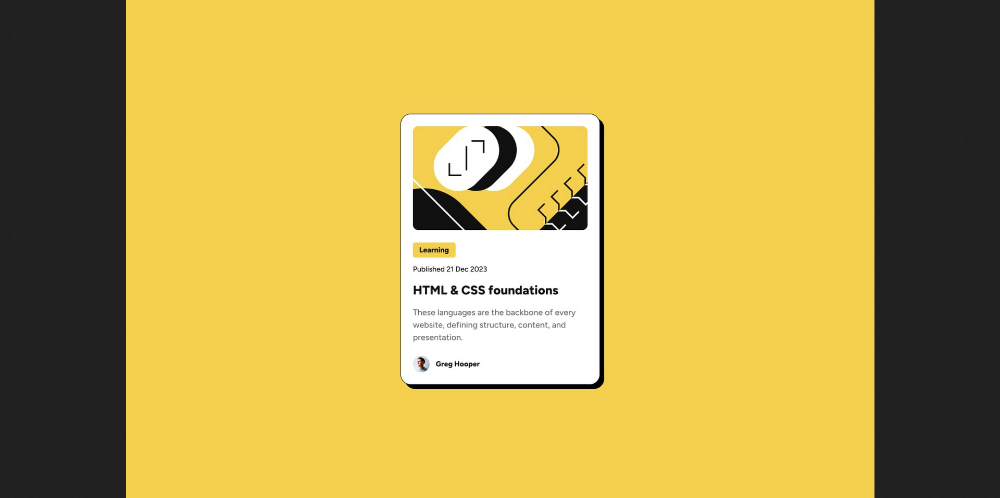

# Frontend Mentor - Blog preview card solution

This is a solution to the [Blog preview card challenge on Frontend Mentor](https://www.frontendmentor.io/challenges/blog-preview-card-ckPaj01IcS). Frontend Mentor challenges help you improve your coding skills by building realistic projects. 

## Table of contents

- [Overview](#overview)
  - [The challenge](#the-challenge)
  - [Screenshot](#screenshot)
  - [Links](#links)
- [My process](#my-process)
  - [Built with](#built-with)
  - [What I learned](#what-i-learned)
  - [Continued development](#continued-development)
  - [Useful resources](#useful-resources)
- [Author](#author)

## Overview
This is a blog preview card built using standard HTMl & CSS

### The challenge

Users should be able to:

- See hover and focus states for all interactive elements on the page

### Screenshot

### Links

- Solution URL: [Click Here](http://127.0.0.1:5500/index.html)
- Live Site URL: [Click Here](https://hgb0043.github.io/blog-preview-card--3/)

## My process

- First, create an index.html file; this will serve as the primary and sole HTML file. 

- Create a css file that will serve as your primary css file; I named mine main.css. If you would like, create a reset.css file and give it a standard css reset (look up css reset if confused).

- Create your HTML structure. There are a few main ways to structure the content. I used a columnal flexbox. You can also use a grid structure if you intend to create a static structure (appropriate for this project).

- Style the page using CSS. This should involve relatively straightforward CSS code using orthodox sizing and some margins. Perhaps the most tricky part of the design is the border and shadow around the main container. A quick hint: The first two values in the "box-shadow" skew the shadow to the right/left and up/down respectively. 

- Finally, create an attribution in the bottom if you would like. I recommend using a "footer" tag on this element and positioning it using "position: absolute" with respect to the body element.

### Built with

- Semantic HTML5 markup
- CSS custom properties
- Flexbox
- Desktop-first workflow

### What I learned

I did not learn any novel code concepts; rather, I got some valuable practice in with some concepts that I was already familiar with but not yet entirely comfortable at the rate I would like.

Understanding how to optimize the HTML layout for CSS styling is still a challenge for me. I am confident, though, that this is something that just naturally improves with more general HTML/CSS practice. 

If you want more help with writing markdown, we'd recommend checking out [The Markdown Guide](https://www.markdownguide.org/) to learn more.

### Continued development

I want to continue to focus on flexbox and its uses and properties. It has been something I have been working on for a while and it is the toughest topic I have ecountered so far in my young programming career.

### Useful resources

- [HTML & CSS Full Course - Beginner to Pro](https://www.youtube.com/watch?v=G3e-cpL7ofc&t=21071s) This is an extremely thorough and helpful HTML & CSS course that I couldn't recommend more.  

## Author
- Frontend Mentor - [@hgb0043](https://www.frontendmentor.io/profile/hgb0043)
- Twitter - [@hgblackstone](https://www.twitter.com/hgblackstone)
- LinkedIn [@hayes_blackstone])https://www.linkedin.com/in/hayes-blackstone-a74182352/ 
